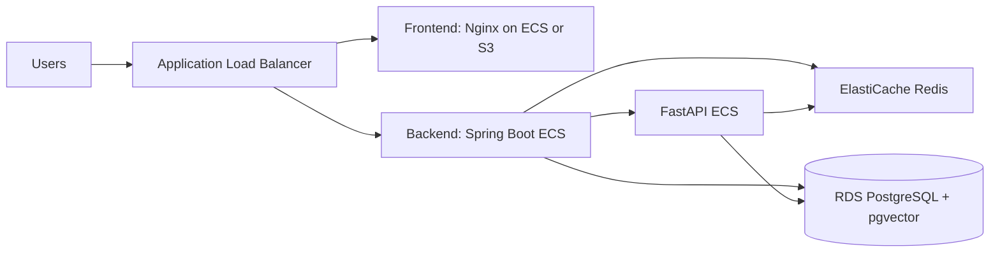

# TruthStream — API Keys, Search Setup, Docker & AWS Deployment

This guide covers how to configure API keys, set up search fallback modes, and deploy TruthStream using **Docker Compose** or on **AWS**.

---

## 1. Environment Configuration

At the project root, copy the environment template to create your `.env` file:

```powershell
Copy-Item .env.example .env
```

Ensure each variable uses `KEY=value` format (with no spaces around the `=`). For example:

```env
GEMINI_API_KEY=your-gemini-key
SERPAPI_KEY=replace-me
```

### Generating Secrets
Generate a 32-character hexadecimal key for the `INTERNAL_API_SECRET` variable. This key secures Spring Boot-to-FastAPI communication. Run this in PowerShell:

```powershell
$bytes = New-Object byte[] 16
[System.Security.Cryptography.RandomNumberGenerator]::Create().GetBytes($bytes)
[System.BitConverter]::ToString($bytes) -replace '-', ''
```

> [!WARNING]
> Never commit your `.env` file to Git. It contains sensitive credentials and is ignored by `.gitignore`.

---

## 2. Gemini API Configuration

TruthStream relies on the **Google GenAI Python SDK** for claim extraction, bias analysis, and verdict synthesis.

- **Models**: Uses `gemini-2.5-flash` for LLM tasks and `text-embedding-004` (768 dimensions) for semantic claim deduplication.
- **Key Rotation**: To bypass API rate limits, the AI service supports key rotation. You can define up to 4 keys in `.env`:
  ```env
  GEMINI_API_KEY_1=key_one
  GEMINI_API_KEY_2=key_two
  GEMINI_API_KEY_3=key_three
  GEMINI_API_KEY_4=key_four
  ```
  The service rotates keys automatically if a `429` (Quota Exceeded) or `403` (Permission Denied) error occurs.
- **Sandbox Fallback Mode**: If all configured Gemini API keys fail, the system activates **Sandbox Mock Fallback Mode**, generating realistic simulated responses. This ensures the application remains functional for testing and demonstrations.

### Obtaining a Gemini Key
1. Go to the [Google AI Studio](https://aistudio.google.com/app/apikey).
2. Sign in with your Google account.
3. Click **Create API Key**.
4. Set usage limits if necessary, copy the key, and paste it into `.env`.

---

## 3. Web Search Integrations

TruthStream searches the web for evidence to verify claims. It uses the following search sources:

1. **SerpAPI (Primary, Optional)**: Used if `SERPAPI_KEY` is set to a valid API key (~100 free searches/month).
2. **DuckDuckGo (Free Fallback, Default)**: Used if SerpAPI is unconfigured, exhausted, or returns an error. DuckDuckGo queries are scraped directly from its HTML endpoint, requiring **no API keys** or subscriptions.

> [!NOTE]
> **Dead Configuration**: The `.env.example` and `docker-compose.yml` files reference `BRAVE_API_KEY`. However, Brave search is **not implemented** in the search service (`ai-service/services/search.py`). You can safely ignore this variable.

---

## 4. Docker Deployment

TruthStream includes a `docker-compose.yml` configuration to orchestrate all services: **db**, **redis**, **ai-service**, **backend**, and **frontend**.

### Setup Steps
1. Open PowerShell and navigate to the project root:
   ```powershell
   cd d:\Truthstream
   ```
2. Load the environment variables:
   ```powershell
   . .\load-env.ps1
   ```
3. Start the containers in the background:
   ```powershell
   docker compose up --build -d
   ```
4. Verify the container status:
   ```powershell
   docker compose ps
   ```
   Both the `db` and `redis` services must show `healthy` before the backend starts processing.

---

## 5. AWS Deployment

To deploy TruthStream in production on AWS, you can choose between a single EC2 instance or an ECS Fargate setup.



### Option A: Single EC2 Instance + Docker Compose (Simplest)
This option is cost-effective and matches your local Docker configuration:

1. **Launch EC2**: Deploy an Ubuntu 22.04 instance (T3.medium or larger with 4GB+ RAM).
2. **Security Groups**: Allow SSH (22) and HTTP/HTTPS (80/443).
3. **Install Docker**:
   ```bash
   sudo apt update && sudo apt install -y docker.io docker-compose-v2 git
   sudo usermod -aG docker ubuntu
   ```
4. **Deploy**: Clone the repository, create your `.env` file, and run `docker compose up --build -d`.
5. **Reverse Proxy**: Install Nginx or Caddy on the host to manage SSL certificates.

### Option B: AWS ECS Fargate (Scalable Production)
Run each service as an independent container:
- **Frontend**: Build the React bundle and deploy it using an **S3 bucket** and **CloudFront** CDN.
- **Backend (Spring Boot)**: Deploy as an ECS Fargate service mapped behind an Application Load Balancer (ALB).
- **AI Service (FastAPI)**: Deploy as an internal ECS Fargate service (not exposed to the public internet).
- **Database**: Use **RDS PostgreSQL 16**. Connect once and enable the required extensions:
  ```sql
  CREATE EXTENSION IF NOT EXISTS vector;
  CREATE EXTENSION IF NOT EXISTS "uuid-ossp";
  CREATE EXTENSION IF NOT EXISTS pgcrypto;
  ```
- **Redis**: Use **ElastiCache Redis** for queuing and Pub/Sub.

---

## Related Guides
- [README.md](README.md) — Local development and quick start.
- [DEPLOY.md](DEPLOY.md) — Deploying to Railway and Render.
- [Working.md](Working.md) — System internals and architecture.
