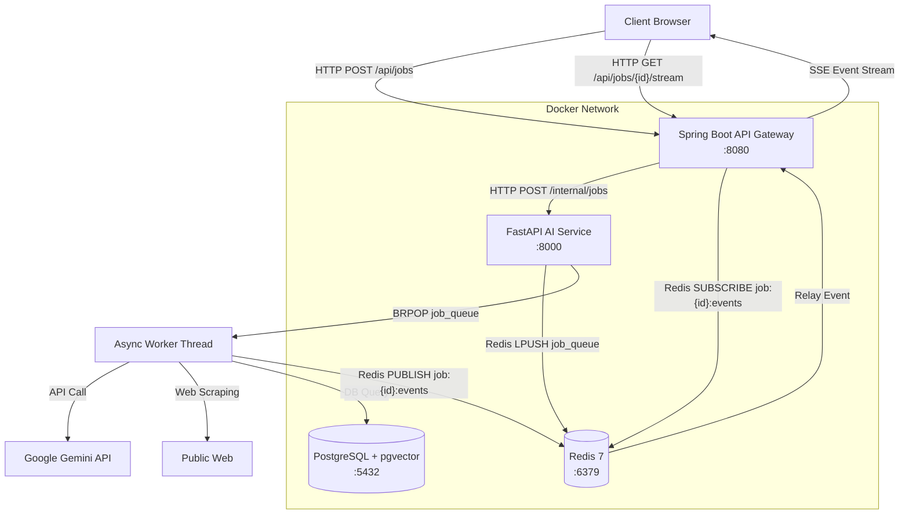
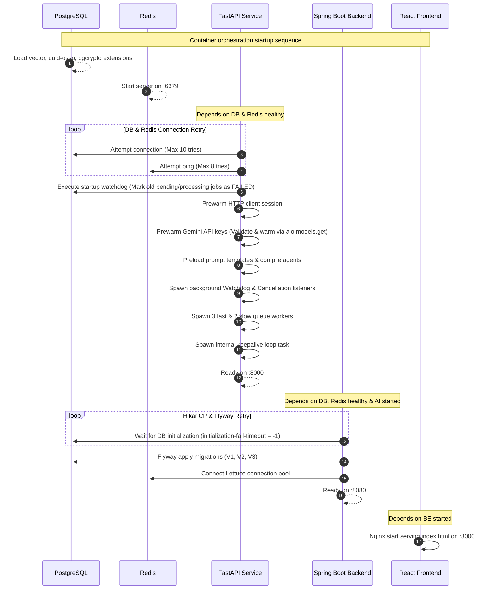
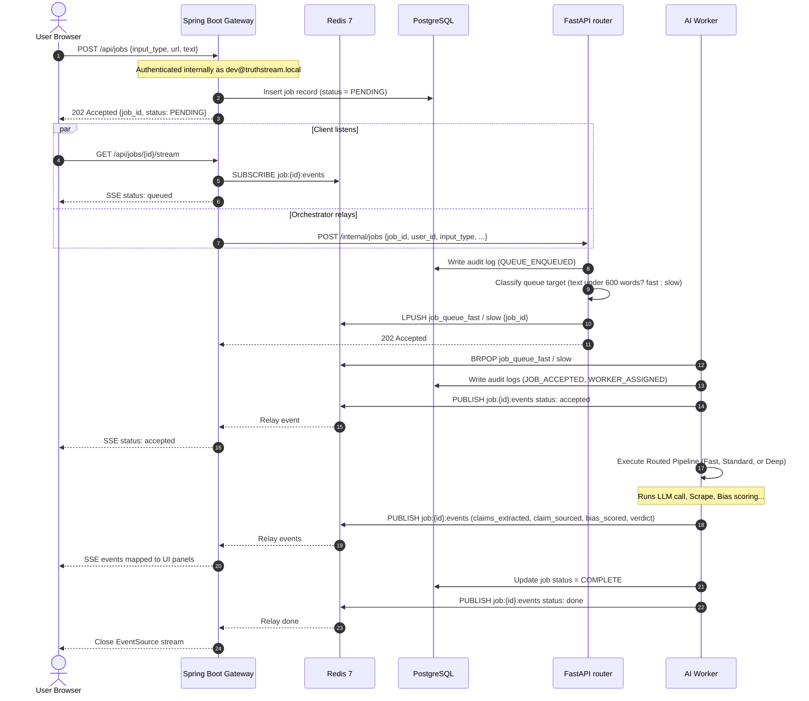
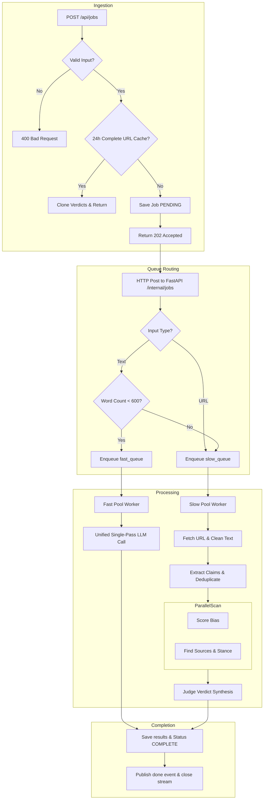

# TruthStream — End-to-End System Internals & Engineering Handbook

Welcome to the definitive internal engineering handbook for **TruthStream**. This document provides an exhaustive, production-grade deep dive into the system's runtime architecture, data flows, execution lifecycles, and component interactions. It is designed to serve as an onboarding guide and technical reference for developers, contributors, and systems engineers.

---

## System Architecture Overview

TruthStream is a distributed, multi-service, multi-agent application containerized via Docker Compose. The platform automates real-time fact-checking by ingesting text or URLs, extracting claims, retrieving corroborating or refuting web evidence, scoring media bias, and synthesizing an overall verdict.

### Global Service Communication Diagram



---

## A. System Startup Flow

When the containers are booted using `docker compose up --build` or the `.\start.ps1` script, services initialize in a strict, health-check-enforced sequence.



### 1. Database & Redis Boot (Infrastructure Layer)
- **PostgreSQL (`truthstream-db`)**: Boots first. It mounts `infra/postgres/init.sql` to `/docker-entrypoint-initdb.d/init.sql` to enable the extensions `vector`, `uuid-ossp`, and `pgcrypto`. The database health check runs `pg_isready` to guarantee availability before downstream services connect.
- **Redis (`truthstream-redis`)**: Boots concurrently. Runs standard Redis 7 configured to run strictly in-memory (`--save "" --appendonly no`) to optimize latency.

### 2. AI Service Boot (`ai-service`)
- **FastAPI Startup Lifespan**:
  - **Database Connection Pool**: Initiates `_connect_db_with_retry` using `asyncpg`. It retries up to 10 times with exponential backoff (starting at 2.0s, capping at 10.0s) to avoid crash-looping if Postgres is temporarily unresponsive.
  - **Watchdog Sweep**: Executes `cleanup_stuck_jobs(pool)`, querying the database to sweep and transition any jobs left in `PENDING` or `PROCESSING` states from a previous session to `FAILED` (error: "Job terminated due to system restart.").
  - **Redis Connection**: Initiates `_connect_redis_with_retry` (retries up to 8 times with 2.0s delays).
  - **HTTP Client**: Prewarms a single global `httpx.AsyncClient` with custom bot headers, connection pooling, and redirect limits.
  - **Gemini Client Prewarming**: Rotates through all configured API keys (`gemini_api_key_1` to `gemini_api_key_4`) and calls the async `aio.models.get` method for the configured model to validate the key, warm up DNS, and pre-establish connection pools (avoiding the deprecated `models.list()` which returned `501 UNIMPLEMENTED`).
  - **Prompt Preloading**: Imports agent files (`bias_scorer`, `extractor`, `judge`, etc.) to parse and cache static prompt templates at startup.
  - **Background Watchdog & Cancellation Listener**: Spawns `stalled_jobs_watchdog` and `cancellation_listener` as concurrent `asyncio` tasks.
  - **Worker Tasks**: Spawns 3 fast workers and 2 slow workers as background queue consumers.
  - **Internal Keepalive Loop**: Spawns a background self-waking routine to ping `/health` every 5 minutes to maintain hot pools and warm runtime state.

### 3. API Gateway Boot (`backend`)
- **Spring Boot 3.2 Lifespan**:
  - **HikariCP Configuration**: Configured with `initialization-fail-timeout: -1`. This forces the connection pool to block and continuously retry establishing a connection to PostgreSQL during startup (up to `connection-timeout: 30000ms`), preventing the Spring Boot container from crashing.
  - **Flyway Migrations**: Applies migration scripts `V1__init_schema.sql`, `V2__fix_unique_constraints.sql`, and `V3__gemini_embeddings.sql` before launching endpoints.
  - **Lettuce Redis Pool**: Establishes connection pools to Redis.
  - **Async Request Handler**: Mounts the async MVC task executor for SSE.

### 4. Frontend Boot (`frontend`)
- **Nginx Serving**: Starts serving the compiled static React bundle (`/dist`) on port 80. Nginx proxies `/api` requests to `http://backend:8080/api` using standard proxy pass headers, including keeping connections alive for SSE streams.

---

## B. Request Execution Flow

The lifecycle of a single query submission is detailed below.



### 1. Ingestion
- **Frontend Submission**: User submits an article URL or raw text in `InputForm.tsx`.
- **Database Entry**: Spring Boot's `JobController` catches the request. Under the hood, Spring Security's `SecurityConfig.java` uses `.anyRequest().permitAll()`. The controller resolves requests to a hardcoded developer user (`dev@truthstream.local`), inserting a new `job` record into PostgreSQL with `status = PENDING`.
- **Immediate Response**: Spring Boot responds to the frontend immediately with HTTP 202 (Accepted) and the `job_id`.
- **Frontend Stream Setup**: The frontend React client opens a persistent Server-Sent Events (SSE) connection to `/api/jobs/{job_id}/stream`. Spring Boot's `SseService` registers an `SseEmitter` and subscribes to a Redis pattern topic `job:{job_id}:events`.

### 2. Gateway Dispatch & Queue Placement
- **Gateway to Python POST**: The Spring Boot backend uses `FastApiClient` to send a non-blocking, asynchronous HTTP `POST` request to FastAPI at `/internal/jobs` carrying `job_id`, `user_id`, `input_type`, and the query payload. It includes the `X-Internal-Secret` header for verification.
- **FastAPI Routing Decision**:
  - FastAPI's `/internal/jobs` endpoint validates the secret.
  - It records a `QUEUE_ENQUEUED` audit log in the database.
  - It inspects the input: if `input_type == "text"` and the word count is strictly under 600 words, it classifies it as a **Fast-Track** job. Otherwise, it is classified as a **Standard/Slow** job.
  - Fast-Track jobs are enqueued to Redis list `job_queue_fast` using `LPUSH`.
  - Standard/Slow jobs (including all URL inputs) are enqueued to `job_queue_slow`.

### 3. Worker pickup
- **BRPOP Consuming**: FastAPI background workers block-pop (`BRPOP`) from their respective Redis lists.
- **Worker Assignment**: Once popped, the worker writes `JOB_ACCEPTED` and `WORKER_ASSIGNED` audit logs.
- **Heartbeat Start**: The worker spawns a background `heartbeat_reporter` task that sets a Redis key `job:{job_id}:heartbeat` with a 5-second TTL every 2.0s to prove the node is processing the job.
- **Initial Status Stream**: The worker publishes a status event `status: accepted` to Redis, which the Spring Boot gateway subscribes to and relays to the browser as an SSE event.

### 4. Pipeline Execution & Telemetry relay
- **Pipeline Choice**: The worker executes the designated pipeline (`fast.py`, `standard.py`, or `deep.py`) inside `pipeline_router.py`.
- **Incremental Event Publishing**: As the worker executes tasks (such as claim extraction, source crawling, bias scoring), it updates PostgreSQL tables and publishes events to `job:{job_id}:events` via Redis.
- **Relay Loop**: The Spring Boot gateway picks up these events from Redis Pub/Sub, serializes them using Jackson, and writes them to the client's open `SseEmitter`.
- **Done Event**: Upon completing the pipeline, the worker updates the job status to `COMPLETE` (or `PARTIAL` if using recovery fallback), publishes a `done` event, and deletes the Redis heartbeat key.
- **Connection Close**: The Spring Boot gateway forwards the `done` event, calls `emitter.complete()`, and removes the Redis pattern subscription.

---

## C. File-by-File Execution Explanation

Here is the exact entry points and orchestration dependency map.

### 1. Monorepo Scripts
- `load-env.ps1`: Core environment variable loader script for Windows PowerShell 7. Simulates Linux-style export of variables into the current session using `[System.Environment]::SetEnvironmentVariable`.
- `start.ps1`: Boots infrastructure, conducts pre-flight checks, and loads configuration.
- `stop.ps1`: Shuts down docker containers and handles volume cleanups.

### 2. Spring Boot Gateway Service (`/backend`)
- **Entry Point**: `TruthStreamApplication.java`
- **Config**:
  - `config/SecurityConfig.java`: Configures Spring Security filter chain. Enforces `.permitAll()` for all endpoints, bypassing token validation for development.
  - `config/RedisConfig.java`: Sets up `RedisTemplate` serialization and registers the message listener container.
  - `config/WebConfig.java`: Configures global CORS parameters.
- **Controllers**:
  - `controller/JobController.java`: Main job gateway controller. Bypasses JWT validation, maps requests to the hardcoded `dev@truthstream.local` user, exposes POST submissions, SSE streaming endpoints, and cancellation triggers.
  - `controller/AuthController.java`: Registers and logs in users, returning JWT tokens (which are currently not enforced by `SecurityConfig`).
  - `controller/VerdictController.java`: Retrieves completed verdicts.
- **Services**:
  - `service/JobService.java`: Orchestrates database insertions, handles transaction synchronization commits, and maps cancellation events.
  - `service/FastApiClient.java`: Non-blocking, reactive HTTP client wrapper using `WebClient` to dispatch tasks to FastAPI.
  - `service/SseService.java`: Multi-thread safe registry tracking active `SseEmitter` instances and binding/unbinding dynamic Redis pub/sub listeners.
  - `service/JobResultService.java`: Handles database hydration for completed verdicts.

### 3. FastAPI AI Service (`/ai-service`)
- **Entry Point**: `main.py`
  - Initializes database pool (`asyncpg`) and Redis client.
  - Runs startup watchdog to fail old stuck jobs.
  - Prewarms HTTP client session and rotates Gemini API keys.
  - Spawns background tasks (`stalled_jobs_watchdog`, `cancellation_listener`) and async worker processes.
- **Routers**:
  - `routers/internal.py`: Exposes `/internal/jobs`. Receives posts from Spring Boot, performs complexity routing, and enqueues jobs to Redis.
  - `routers/observability.py`: Exposes `/system/health`, `/jobs/{job_id}/metrics`, and telemetry endpoints.
- **Orchestration**:
  - `orchestration/worker_executor.py`: Defines the `WorkerPool` class, instantiates `fast_worker_pool` and `slow_worker_pool`, manages concurrent slot allocations, heartbeats, and cancellations.
  - `orchestration/pipeline_router.py`: Classifies incoming article complexity, implements URL cache deduplication, and routes execution to specific pipelines.
- **Pipelines**:
  - `orchestration/pipelines/fast.py`: Runs a single-pass prompt to extract claims, score bias, and judge veracity in one LLM turn.
  - `orchestration/pipelines/standard.py`: Standard fact-checking flow. Extracts up to 3 claims, performs search snippet stance evaluations (bypass mode), scores bias in parallel, and runs the judge.
  - `orchestration/pipelines/deep.py`: Deep fact-checking flow. Extracts up to 5 claims, scrapes source URLs in parallel, performs stance evaluation on scraped text, scores bias, and runs the judge.
  - `orchestration/pipelines/recovery.py`: Fallback path. Triggered if extraction or pipelines fail. Summarizes text and requests a best-effort overall verdict from the LLM.
- **Agents**:
  - `agents/extractor.py`: Identifies verifiable factual claims via structured prompts.
  - `agents/source_finder.py`: Handles web search query formulation, retrieves results, performs lexical overlap ranking, scrapes URLs (in deep mode), and runs stance classification.
  - `agents/bias_scorer.py`: Evaluates loaded terminology, framing flags, and bias scores.
  - `agents/judge.py`: Evaluates consensus matrices and calculates overall verdicts.

---

## D. Tech Stack & Library Explanation

Every library choice in TruthStream plays a critical role in maintaining system performance.

| Library / Framework | Runtime Role Inside System | Performance & Architecture Implications | Alternatives |
|---|---|---|---|
| **React 19** | Dynamic client application rendering. Uses concurrent rendering hooks. | Fast UI updates; state updates are batched during streaming. | Vue 3, Svelte |
| **Vite 8** | Frontend build tool and development server. | Fast HMR (Hot Module Replacement) during development. | Webpack |
| **TailwindCSS v4** | Utility-first styling framework. | Low CSS payload footprint; styles compile to tiny utility files. | Vanilla CSS |
| **Spring Boot 3.2** | Orchestration gateway and SSE connection manager. | Highly scalable connection pooling. Ideal for managing long-lived SSE connections. | Express (Node.js) |
| **FastAPI** | Python web framework hosting AI models and agents. | Extremely fast ASGI framework. Leverages Python's ecosystem for AI and async. | Flask, Django |
| **Redis 7** | Dual job queue, Pub/Sub channel, and search caching. | Sub-millisecond queue latency. Replaces heavyweight systems like Kafka. | RabbitMQ, Celery |
| **PostgreSQL 16** | Relational data persistence. | Holds structural constraints. Single source of truth. | MySQL |
| **pgvector** | Vector similarity plugin for PostgreSQL. | Evaluates 768-dim claim embeddings. Enables semantic deduplication in-database. | Pinecone, Milvus |
| **asyncpg** | Asynchronous PostgreSQL database driver for Python. | Achieves high throughput by bypassing blocking psycopg2 drivers. | psycopg2 |
| **Google GenAI SDK** | Google API wrapper for Gemini models. | Connects to `gemini-2.5-flash` and `text-embedding-004` endpoints. | LangChain |
| **BeautifulSoup4 (lxml)** | CPU-bound HTML DOM cleaner. | Sanitizes raw web scraps into clean text for LLM consumption. | Scrapy |

---

## E. Pipeline & Agent Orchestration

### 1. Worker pools (`WorkerPool`)
TruthStream manages concurrency using a custom `WorkerPool` instead of standard global semaphores to prevent blocking:
- **Fast-Track Pool**: Configured with `max_concurrent_jobs = 5`. Shared across 3 fast workers. It allows up to 15 concurrent fast tasks on a single node (3 workers × 5 jobs max via async concurrency).
- **Slow-Track Pool**: Configured with `max_concurrent_jobs = 2`. Shared across 2 slow workers, allowing up to 4 concurrent slow scrapes.

If a worker is assigned a job but the pool is at capacity, the job is placed in a local `waiting_queue`. The worker publishes a status update (`waiting: Position X in worker queue`) to keep the user informed.

### 2. Search & Scraping Strategies
- **Lexical Overlap Snippet Reranker**: 
  To reduce search bottlenecks, search results are ranked using a lexical overlap algorithm:
  
  $$\text{Score} = \frac{|W_{\text{claim}} \cap W_{\text{snippet}} - W_{\text{stop}}|}{|W_{\text{claim}} - W_{\text{stop}}|}$$
  
  This ranks the most relevant search snippets first.
- **Crawler/Scraper Bypass (Standard Path)**: 
  Standard-complexity jobs bypass the slow step of scraping target web pages. The `Source Finder` agent evaluates source stances and quality scores *strictly* from the search engine snippets and domains. This reduces execution times by up to 90%.
- **Deep Scraper Concurrency (Deep Path)**: 
  Deep-complexity jobs fetch the full text of the top 3 results. Scraping tasks are run in parallel using `asyncio.gather` and bounded by a semaphore limit of 5.

### 3. Verdict Calculations (Judge Synthesis)
The `Judge` agent evaluates the consensus matrix. If the LLM call fails or times out, the system uses a mathematical fallback method (`utils/verdict_calc.py`):
1. **Source Filtering**: Filter sources with a `quality_score` > 0.6.
2. **Stance Counting**: Count supporting ($S$) and refuting ($R$) sources.
3. **Claim Verdict Rules**:
   - If $S \ge 1$ and $R = 0$: `SUPPORTED`, confidence = $\text{average}(Q_{\text{supports}})$.
   - If $R \ge 1$ and $S = 0$: `REFUTED`, confidence = $\text{average}(Q_{\text{refutes}})$.
   - If $S \ge 1$ and $R \ge 1$: `CONTESTED`, confidence = $|S - R| / (S + R) \cdot \text{average}(Q)$.
   - If $S = 0$ and $R = 0$: `UNVERIFIABLE`, confidence = 0.10.
4. **Bias Penalty**: If the article's `bias_score` is > 70, the overall confidence is reduced by 0.15.

### 4. Cooperative Cancellation & Watchdogs
- **Heartbeat Checks**: Active worker tasks update Redis every 2.0s.
- **Cancellation**: If a user cancels a job on the frontend:
  1. Spring Boot updates the job status to `FAILED` in the database.
  2. Spring Boot publishes the `job_id` to the `job:cancel:events` Redis channel.
  3. FastAPI's `cancellation_listener` receives the event and looks up the active task in its registry.
  4. The listener calls `task.cancel()`, raising an `asyncio.CancelledError` to cleanly abort the task.
- **Watchdog Recovery**: The `stalled_jobs_watchdog` runs every 15s. If a job remains in `PENDING` or `PROCESSING` state for more than 45 seconds, the watchdog triggers a cancellation event, logs the timeout, and marks the job as `FAILED`.

---

## F. Frontend Internal Working

The React frontend is built to render streaming SSE data efficiently.

```
LandingPage (URL/Text Input)
  │
  ▼  (POST /api/jobs triggers redirect to /jobs/:id)
JobPage
  ├── useJobHydration (Check DB status on mount)
  ├── useJobStream (Open EventSource on active job)
  ├── UI Layout Grid
        ├── LoadingState (Renders current stage and bypass path)
        ├── VerdictBanner (Displays final verdict)
        ├── D3 Components (Gauge and Timeline)
        └── ClaimList -> ClaimCard -> SourceCard Accordions
```

### 1. State Management
All streaming state is managed using React Context and `useReducer` (`JobContext.tsx`). This provides a single source of truth for claims, sources, bias, and verdicts. The actions include:
- `HYDRATE`: Preloads state for completed jobs when navigating directly to `/jobs/:id`.
- `SET_STAGE`: Updates the current execution stage (e.g., `fetching`, `extracting`).
- `ADD_CLAIMS`: Appends extracted claims to the state.
- `ADD_SOURCES`: Dynamically attaches sources to their corresponding claims as they are resolved.
- `SET_BIAS`: Hydrates bias scoring details.
- `SET_VERDICT`: Hydrates final verdicts.

### 2. D3 gauge & Timeline Visualizations
- **ConfidenceGauge (`ConfidenceGauge.tsx`)**: Renders a semi-circular arc gauge using D3. It animates from 0% to the overall confidence percentage when the final verdict is received. Colors transition from red (low confidence) to amber (medium) to green (high).
- **VerdictTimeline (`VerdictTimeline.tsx`)**: Plots claims chronologically using a D3 horizontal axis. Node colors reflect claim verdicts (green for supported, red for refuted, yellow for contested/unverifiable). Hovering over a node displays a tooltip with details about the claim and the reasoning behind its verdict.

---

## G. Backend Internal Working

The Spring Boot backend acts as a connection relay and database coordinator.

- **Non-blocking Dispatch**: The gateway uses WebClient to hand off jobs to FastAPI. It uses a `TransactionSynchronization` hook to ensure the job is dispatched *after* the database transaction commits, preventing race conditions:
  ```java
  TransactionSynchronizationManager.registerSynchronization(
      new TransactionSynchronization() {
          @Override
          public void afterCommit() {
              fastApiClient.dispatchJob(...);
          }
      }
  );
  ```
- **SSE Connection Management**: The `SseService` registers `SseEmitter` instances and handles connection lifecycles (timeout, completion, client disconnects).
- **Redis Event Relay**: Uses a Lettuce-backed Redis listener to subscribe to events for active jobs and relay them to the client:
  ```java
  MessageListener listener = (message, pattern) -> {
      String body = new String(message.getBody());
      // Serialize and relay via SseEmitter...
  };
  ```

---

## H. Database & Cache Flow

```
Search Query ──► Redis GET search:{md5} ──► Hit: Return results
                      │
                      ▼ Miss
                SerpAPI / DuckDuckGo ──► Redis SETEX (2 hr TTL)
```

- **URL Hash Cache**: When a URL is submitted, the backend hashes the URL using MD5. If a matching URL hash with a `COMPLETE` status is found in the database from the last 24 hours, the backend clones the cached results for the new job, bypassing execution entirely.
- **pgvector Indexing**: The `claims` table stores claim embeddings in the `embedding` column using a 768-dimension `vector` type. It uses an `ivfflat` index with 100 lists to optimize search performance:
  ```sql
  CREATE INDEX idx_claims_embedding ON claims USING ivfflat (embedding vector_cosine_ops) WITH (lists = 100);
  ```
- **Semantic Deduplication**: Before processing an extracted claim, the AI service queries Postgres for similar claims using cosine distance:
  ```sql
  SELECT id, 1 - (embedding <=> $1::vector) AS similarity
  FROM claims
  WHERE 1 - (embedding <=> $1::vector) > 0.9
  LIMIT 1;
  ```
  If a match is found, the system reuses the existing claim ID and its completed verdict.

---

## I. Performance & Bottleneck Analysis

### 1. Latency Breakdown & Budgets

The table below shows execution times and latency budgets for the three pipeline paths.

| Pipeline Stage | Fast-Path Mode | Standard Path (Snippet Bypass) | Deep Path (Full Scraping) | Bottleneck Source |
|---|---|---|---|---|
| **URL Fetch** | N/A | 1.0s – 3.5s | 1.0s – 3.5s | Target domain network response latency |
| **Claim Extraction** | 3.5s – 5.0s (Unified) | 2.5s – 3.5s | 3.0s – 4.0s | LLM token generation latency |
| **Search Querying** | N/A | 0.8s – 1.5s | 0.8s – 1.5s | External Search Engine API network latency |
| **Source Scraping** | N/A | Bypassed (0.0s) | 4.0s – 12.0s | Parallel page loads and HTML parsing |
| **Stance Classification** | N/A | 1.5s – 2.5s | 2.0s – 3.5s | LLM evaluation times |
| **Bias Scoring** | N/A | 2.0s – 3.0s (Parallel) | 2.0s – 3.0s (Parallel) | LLM evaluation times |
| **Verdict Synthesis** | N/A | 1.5s – 2.2s | 1.5s – 2.2s | LLM evaluation times |
| **Total Latency** | **3.5s – 5.0s** | **6.8s – 11.7s** | **12.3s – 26.7s** | Bounded by step timeouts |

### 2. Architectural Bottlenecks & Solutions
- **Event Loop Blocking**: 
  *Problem*: DNS resolution (`socket.gethostbyname`) and HTML cleaning (`BeautifulSoup`) are CPU-bound and can block the single-threaded Python event loop.
  *Solution*: These operations are run asynchronously using thread executors (`loop.run_in_executor(None, ...)`).
- **Network Delays during Scraping**: 
  *Problem*: Scraping reference web pages in deep mode can block execution if target servers are slow or rate-limit the bot.
  *Solution*: Scraping tasks run in parallel using `asyncio.gather` with a 4.0s timeout per page and a semaphore limit of 5. Results are cached in Redis for 6 hours.
- **Worker Pool Contention**: 
  *Problem*: Slow scrapes in the slow worker pool can exhaust available worker threads.
  *Solution*: The queue is split into two pools (`fast` and `slow`) so that short text checks bypass the scraping queue and run without delay.

---

## J. Runtime Debugging Guide

### 1. Tracing a request
To trace a job's lifecycle, query the database's `audit_log` table:
```sql
SELECT action, created_at, details 
FROM audit_log 
WHERE job_id = 'YOUR-JOB-UUID' 
ORDER BY created_at ASC;
```
This returns the sequence of execution stages (e.g., `QUEUE_ENQUEUED` $\to$ `JOB_ACCEPTED` $\to$ `EXTRACTION_STARTED` $\to$ `JOB_COMPLETED`).

### 2. Core Logs to Monitor
- **Spring Boot Logs (`docker logs -f truthstream-backend`)**:
  - `Transaction committed. Dispatching job...`: Confirms the job was sent to the FastAPI service.
  - `SSE registered for job...`: Confirms the client stream is connected.
- **FastAPI Logs (`docker logs -f truthstream-ai`)**:
  - `Worker picked up job...`: Confirms the task was retrieved from the Redis queue.
  - `[INSTRUMENTATION] Job...`: Displays execution times for database fetches, URL scraping, complexity classification, and model calls.

### 3. Database Inconsistencies to Note
- **Observability Router Table Name Mismatch**:
  The `observability` router (`ai-service/routers/observability.py`) queries the `audit_logs` table (plural). However, the actual database schema table is named `audit_log` (singular). This causes endpoints like `/observability/jobs/{job_id}/metrics` to fail with a PostgreSQL error.

---

## K. Core Orchestration Diagrams

### End-to-End Pipeline Execution Detail



---

*This handbook matches the implementation of the TruthStream monorepo codebase. Refer to the corresponding source files for details.*
